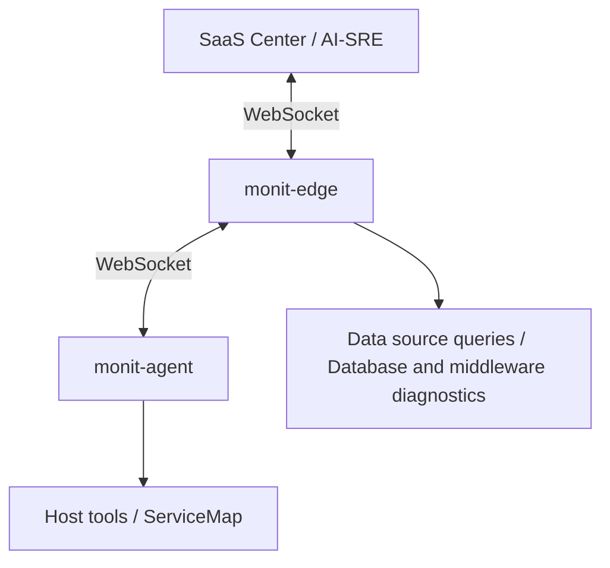

Monitoring objects are the targets that Monitors can query and diagnose. After `monit-agent` is installed and started, the platform automatically displays the host object it reports. Edge queries and diagnoses databases and middleware through Monitors data sources, independently of Agent configuration.

## Why monit-agent is needed

Traditional observability data usually includes metrics, logs, traces, and alert events. These data types help you understand what happened, but real troubleshooting often requires checking the live environment, for example:

- Which processes on the current machine are using high CPU or memory.
- Whether a port, domain, or service can be reached from the target machine.
- Whether disks, mount points, network interfaces, or connection counts are abnormal.

Collected data alone may not answer these questions. In many cases, you need to query the live environment. `monit-agent` is designed for this scenario.

In AI-SRE scenarios, you can think of the LLM as the diagnostic brain, and `monit-agent` as the execution endpoint deployed in your environment. After a user asks a question in natural language, the LLM understands the question, selects suitable diagnostic tools, and explains the result. `monit-agent` runs controlled diagnostics on the target host and returns structured results to the system.

<Warning>
The Agent controls execution through tool policies, parameter validation, command restrictions, timeouts, and output limits. It also supports sensitive data masking and local auditing. Unknown `shell.exec` commands require local root approval by default. With `allow`, these commands run directly as the Agent account and can modify data or affect services. Read [Unknown command policy](/en/monitors/targets/configure-targets#unknown-command-policy) before configuring it.
</Warning>

## Technical Architecture

`monit-agent` connects to `monitedge` in the same network region over WebSocket. `monitedge` then connects to the SaaS Center over WebSocket. In most deployments, each network region has one `monitedge` cluster, and multiple `monitedge` instances with the same `EngineName` are treated as one engine cluster.

## Host diagnostics and data source diagnostics

| Diagnostic scope | Setup | Execution location |
|---|---|---|
| Live host CPU, memory, processes, disks, networking, and container state | Install an Agent on the target host and configure host tools as needed | `monit-agent` on the target host |
| MySQL, Redis, PostgreSQL, MongoDB, Kafka, Elasticsearch, and other services | Configure the corresponding Monitors data source | `monit-edge` with access to the data source |

The Agent provides five host tools: `os.overview`, `os.top_processes`, `shell.exec`, `net.tcp_ping`, and `http.get`. The available set depends on the Agent version and local policy. TCP/HTTP probes provide connectivity evidence from the host; data source diagnostics inspect database internals.

Agent host tools act on the host only: `tools-catalog` and `tools-invoke` support only the `host` target kind, and database service endpoints are not Agent targets. For database and middleware diagnostics, use the **datasource tools** instead (see below), executed by the Edge that can reach the data source. Datasource tool invocation requires the data source `enabled=true`; `alerting_enabled=false` does not block diagnostics.

### Datasource tools

Every configured data source provides a set of named diagnostic tools, prefixed by the data source type, for example:

| Data source type | Example tools |
|------------------|---------------|
| MySQL | `mysql.overview`, `mysql.lock_contention` |
| PostgreSQL | `postgres.activity` |
| Redis | `redis_node.slowlog` |
| Kafka | `kafka.consumer_lag` |
| Elasticsearch | `elasticsearch.cat` |
| Prometheus | `prometheus.metric_trends` |
| Loki / VictoriaLogs | `loki.log_patterns`, `victorialogs.log_patterns` |

- **One call invokes one named tool**, targeted by data source ID (`datasource_id`). The same connection address configured as multiple data source IDs means different credentials or configurations and must remain separate.
- **No tool catalog**: tool names and parameters come from the type-specific reference — do not guess parameters. The `mysql.query` and `postgres.query` tools have been removed; use data source queries (monit-query Data) for free-form SQL.
- **Version gate**: all currently online routable Edge sessions in the selected cluster must support the v0.71.0 base invoke protocol; individual tools may require a newer implementation. See the error reasons below when the gate is not met.
- **No automatic fallback**: the endpoint provides no tool catalog, automatic replay, or fallback to Agent or the legacy diagnose flow. On version-related errors, upgrade Edge rather than restarting or rotating Edges. Request body limit 128 KiB; complete success response limit 1 MiB; tool timeout at most 25 seconds.

Errors are returned via `error.reason`:

| reason | Meaning |
|--------|---------|
| `edge_upgrade_required` | Edge version below v0.71.0; upgrade the Edges in the cluster |
| `mixed_edge_versions` | Mixed Edge versions in the cluster with some instances outdated; upgrade them uniformly |
| `no_active_edge` | No online routable Edge session in the cluster |
| `tool_not_supported` | The tool is not supported by the current implementation |
| `invalid_request` | Invalid request parameters; fix the parameters and retry |
| `source_too_large` | Request body exceeds 128 KiB; narrow the request |
| `result_too_large` | Result exceeds 1 MiB; narrow the request |
| `datasource_disabled` | The data source is disabled (`enabled=false`) |
| `datasource_not_found` | The data source does not exist |

The Agent also provides host topology collection and reporting for [ServiceMap](/en/monitors/targets/servicemap).

<Tip>
Use stable and recognizable values for object identifiers (`target_locator`), such as fixed private IP addresses or DNS names. Do not use addresses that only make sense locally, such as `localhost` or `127.0.0.1`, as the displayed object address.
</Tip>

## How objects appear in the console

Monitoring objects do not need to be created manually in the console. Install and start `monit-agent` on the target machine. After the Agent successfully connects to Edge, it reports the current host identity, and the console displays that host automatically.

If a new user enters the monitoring object page and sees an empty list, it usually means no Agent has connected successfully. Each Agent reports its own host object. Manage database and middleware connections through [data sources](/en/monitors/data-sources/data-sources).

## Recommended onboarding path

<Steps>
<Step title="Install and start monit-agent">
Onboard the host object first, confirm that the Agent can connect to Edge, and verify that the current host appears in the console.
</Step>
<Step title="Configure host tools as needed">
Adjust host collection settings, Shell execution policies, and disabled tools in `agent.yaml`.
</Step>
<Step title="Verify live diagnostics">
Confirm that host tools are available. Configure a separate data source when you need database or middleware diagnostics.
</Step>
</Steps>

## Related docs

<CardGroup cols={2}>
  <Card title="Install monit-agent" icon="download" href="/en/monitors/targets/install-agent">
    Prepare the Edge address, download the Agent, and start it in the foreground or as a system service.
  </Card>
  <Card title="Configure host diagnostic tools" icon="sliders" href="/en/monitors/targets/configure-targets">
    Configure host collection, Shell execution policies, and tool switches.
  </Card>
</CardGroup>
