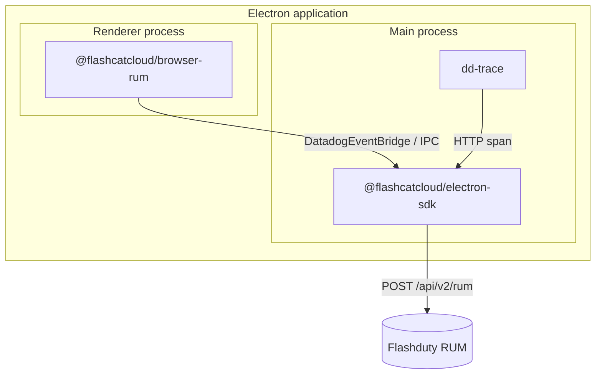

An Electron application runs a **main process** (Node.js) and one or more **renderer processes** (Chromium). Because the two runtimes are completely different, Electron RUM integration requires two packages:

| Process | Package | What it collects |
|---------|---------|------------------|
| Main process | `@flashcatcloud/electron-sdk` | Session, view, Node errors, native crashes, main-process network requests |
| Renderer process | `@flashcatcloud/browser-rum` | Page views, user actions, front-end resources, JS errors, Web Vitals |

<Warning>
Installing only one half is the most common integration mistake. With only the main-process SDK you lose all front-end interaction data. With only the renderer SDK you lose the session, main-process errors, and native crashes, and events never carry the `container` information that correlates the two processes. Integrate both processes.
</Warning>

## Read this first: three misconfigurations that never raise an error

The three items below share one property: **when you get them wrong, nothing complains**. The application keeps running, the SDK stays quiet, and the console shows no warning — one kind of data simply never shows up, or a feature just looks like it "did not work". They are painful to diagnose after the fact, so skim them before you start.

| What you see | What is actually happening | What to do |
|--------------|----------------------------|------------|
| Session Replay is enabled, but no session ever has a replay — `session.has_replay` stays `0` and not a single segment arrives. It looks exactly like recording was never turned on | The page's own CSP blocks the entire replay pipeline. Recording creates a blob Worker in the renderer and sends segments straight to the intake, and a common `script-src 'self'` policy blocks both | Allow `worker-src blob:` and the intake origin in your CSP — see [CSP requirements for Session Replay](#csp-requirements-for-session-replay) |
| Source maps are uploaded, yet stacks still show minified positions such as `app:///dist/renderer.js:12315:24`, with no source snippet | The `--release-version` you uploaded does not match the **renderer's** `version`. A renderer event takes its `version` only from `flashcatRum.init()`; the `version` on the main-process `init()` does not apply to it | Keep both values identical — see [The version must match the renderer process](/en/rum/sdk/electron/advanced-config#the-version-must-match-the-renderer-process) |
| A replay plays back with a garbled, out-of-sync stretch in the middle, even though the timeline looks continuous | Replay segments produced while the network was down were dropped, and they are never resent | A known limitation of the current version that configuration cannot work around — see [Replay segments are lost during a network outage](#replay-segments-are-lost-during-a-network-outage) |

The first and third items only affect applications with Session Replay enabled; the second applies to every application.

## How it works

The main-process SDK is the **single exit point** for the whole pipeline. It does three things:

1. Uses `dd-trace` to hook `require('electron')`, wrap `BrowserWindow`, and inject a preload script into every renderer process that exposes a global `DatadogEventBridge` object.
2. The renderer's `@flashcatcloud/browser-rum` detects that bridge and sends its collected events back to the main process over IPC instead of uploading them itself.
3. The main process enriches events from both sides — its own events get the full set of common attributes, while renderer events only have `session.id` / `application.id` overridden and `container` added — then buffers them to disk in batches and uploads them to `POST https://<site>/api/v2/rum`.



<Note>
Internal module names, plugin names, and the bridge object keep the `Datadog` / `dd-` prefix (for example `DatadogEventBridge` and `datadogVitePlugin`). This follows the upstream fork naming convention and does not affect data routing — events are only sent to the Flashduty `site` you configure.
</Note>

## Prerequisites

- Electron 39 or later (the SDK declares `peerDependencies: electron >= 39`)
- An **Electron** application created on the [RUM applications](https://console.flashcat.cloud/rum/apps) page of the Flashduty console, with its **Application ID** and **Client Token**
- Network access from your application to `https://browser.flashcat.cloud/api/v2/rum` (or your own endpoint for self-hosted deployments)

## Install

```bash
# Main process
npm install @flashcatcloud/electron-sdk

# Renderer process
npm install @flashcatcloud/browser-rum
```

## Main process integration

### Import the instrument entry point

`@flashcatcloud/electron-sdk/instrument` must run **before any `electron` import**. It initializes `dd-trace`, which has to register its module hooks before `require('electron')` happens. Otherwise `BrowserWindow` preload injection never takes effect and renderer processes never receive the bridge object.

```ts main.ts
// Must be the first import in the file
import '@flashcatcloud/electron-sdk/instrument';

import { app, BrowserWindow } from 'electron';
```

<Warning>
Do not let a formatter or import-sorting rule move this line down. If your project uses ESLint's `import/order` or `simple-import-sort`, add an ignore comment for this line.
</Warning>

### Initialize the SDK

Call `init()` before creating any `BrowserWindow`. It is asynchronous and returns `true` when the configuration is valid and initialization succeeded.

```ts main.ts
import '@flashcatcloud/electron-sdk/instrument';

import { app, BrowserWindow } from 'electron';
import { init } from '@flashcatcloud/electron-sdk';

void app.whenReady().then(async () => {
  await init({
    applicationId: '<YOUR_APPLICATION_ID>',
    clientToken: '<YOUR_CLIENT_TOKEN>',
    service: 'my-electron-app',
    site: 'browser.flashcat.cloud',
    env: 'production',
    version: app.getVersion(),
  });

  createWindow();
});
```

#### Required parameters

<ParamField body="applicationId" type="string" required>
Application ID, available on the applications page
</ParamField>

<ParamField body="clientToken" type="string" required>
Client token, available on the applications page
</ParamField>

<ParamField body="service" type="string" required>
Service name used to distinguish services. Use the same value when uploading source maps
</ParamField>

<Warning>
`clientToken` is only for client-side RUM reporting — never put a server-side key in client code.
</Warning>

#### Reporting site

<ParamField body="site" type="string" default="browser.flashcat.cloud">
Reporting site, used directly as the intake host. SaaS users can leave it unset; self-hosted deployments set their own domain
</ParamField>

<Note>
The SDK builds the upload URL as `https://<site>/api/v2/rum` — the **`https://` scheme is hardcoded**. If your internal intake is plain HTTP, no value of `site` will help; you must use `proxy` instead. See [When a proxy is required](/en/rum/sdk/electron/advanced-config#when-a-proxy-is-required).
</Note>

See [Advanced configuration](/en/rum/sdk/electron/advanced-config) for the full list of optional parameters.

## Bundler plugins

`dd-trace` depends on runtime module loading order, but bundlers (Vite, Webpack, esbuild) reorder, inline, or hoist `require()` calls, which strips `import '@flashcatcloud/electron-sdk/instrument'` of its "runs first" position. The SDK therefore ships three bundler plugins that:

- Mark `dd-trace` and `@flashcatcloud/electron-sdk` as external so they stay runtime `require`s
- Prepend the instrument initialization to the very top of the main-process entry chunk (**so you no longer need to write that import by hand**)
- Copy the `dd-trace` preload script and the externalized dependencies into the build output's `node_modules`, so packaged applications (such as Electron Forge asars) can resolve them at runtime

Pick **one** that matches your build setup.

<Tabs>
<Tab title="Vite">
For electron-vite and Electron Forge + Vite.

```ts vite.config.ts
import { defineConfig } from 'vite';
import { datadogVitePlugin } from '@flashcatcloud/electron-sdk/vite-plugin';

export default defineConfig({
  plugins: [datadogVitePlugin()],
});
```

<Note>
Add the plugin to the **main process** build configuration. In electron-vite that is the `main` section, not `renderer`.
</Note>
</Tab>

<Tab title="Webpack">
For Electron Forge + Webpack.

```js webpack.main.config.js
const { DatadogWebpackPlugin } = require('@flashcatcloud/electron-sdk/webpack-plugin');

module.exports = {
  plugins: [new DatadogWebpackPlugin()],
};
```

The plugin also excludes `dd-trace` and the SDK from `@vercel/webpack-asset-relocator-loader`, which would otherwise break `dd-trace`'s internal dynamic `require.resolve`.
</Tab>

<Tab title="esbuild">
```ts build.ts
import * as esbuild from 'esbuild';
import { datadogEsbuildPlugin } from '@flashcatcloud/electron-sdk/esbuild-plugin';

await esbuild.build({
  entryPoints: ['src/main.ts'],
  bundle: true,
  platform: 'node',
  outfile: 'dist/main.js',
  plugins: [datadogEsbuildPlugin()],
});
```
</Tab>
</Tabs>

<Tip>
With ESM output, static imports are evaluated before module code runs, so `dd-trace`'s hooks cannot intercept `import 'electron'`. All three plugins handle this by registering the preload directly through `session.defaultSession.registerPreloadScript()`, which is equivalent. No extra configuration is needed.
</Tip>

## Renderer process integration

Pages loaded by renderer processes are integrated exactly like a [Web SDK](/en/rum/sdk/web/sdk-integration) NPM installation — the initialization code is unchanged.

```ts renderer.ts
import { flashcatRum } from '@flashcatcloud/browser-rum';

flashcatRum.init({
  applicationId: '<YOUR_APPLICATION_ID>',
  clientToken: '<YOUR_CLIENT_TOKEN>',
  service: 'my-electron-app',
  site: 'browser.flashcat.cloud',
  env: 'production',
  version: '1.0.0',
  sessionSampleRate: 100,
  trackResources: true,
  trackLongTasks: true,
  trackUserInteractions: true,
});
```

<Tip>
Keep `applicationId`, `clientToken`, `service`, `env`, and `version` identical to the main-process `init()`. Otherwise the two sides land in different applications or versions and cannot be correlated in a single session.
</Tip>

### The bridge needs no configuration

The renderer side requires **no extra wiring**. When the injected preload assembles its host allowlist, it always includes the window's own `location.hostname`:

```js
const allowedHosts = [...new Set([location.hostname, ...configuredHosts])]
```

A window's own page therefore **always matches the allowlist**, and the bridge works out of the box. `file://` is no exception — `location.hostname` is an empty string there, the allowlist becomes `[""]`, and it still self-matches.

<Note>
`allowedWebViewHosts` is not a bridge switch — it is an allowlist for **additional hosts**. Configure it only when you also want to accept events from **third-party** pages loaded in a `<webview>` or `BrowserView`, for example `allowedWebViewHosts: ['partner.example.com']`. Matching supports subdomain suffixes.
</Note>

### What a broken bridge looks like

The bridge fails because of a **missing preload injection**, not because of configuration — usually the main process has not integrated the SDK, or it is bundled without the matching [bundler plugin](#bundler-plugins), so the `instrument` entry point loses its "runs first" position.

| Behavior | Bridge working | Bridge broken |
|----------|----------------|---------------|
| `container.source` on renderer events | `electron` | field absent |
| Upload path | Batched by the main process | Each renderer uploads directly to the intake |
| Session | Shares the main-process `session.id` | Renderer generates its own session |
| Offline retry | Buffered to disk under the main process `userData`, resent after restart | Relies on browser-side buffering, lost when the process exits |
| User activity | Renderer clicks extend the main-process session | No effect on each other |

<Tip>
`container.source` is a reliable signal: when renderer events carry it, the preload was injected and the events really did travel through the main process.
</Tip>

### The `source` value of each process

When the bridge is working, the main process only overrides `session.id` and `application.id` on renderer events and adds `container` — renderer events **keep their own `source: browser`**. The two kinds of events are therefore identified differently:

| Origin | `source` | `container.source` | `view.url` |
|--------|----------|--------------------|------------|
| Main process | `electron` | absent | `electron://main-process` |
| Renderer window | `browser` | `electron` | the page URL |

<Warning>
Filtering on `source:electron` alone in the Explorer returns **main-process events only**. To select everything an Electron application produces, use `source:electron OR container.source:electron`.
</Warning>

## Session Replay

In Electron, Session Replay is recorded by `@flashcatcloud/browser-rum` in the renderer. By default, as soon as the renderer detects the bridge injected by the main process it hands recording over to the host application — and the main-process SDK does not record replays, so **nothing gets recorded at all**. To use Session Replay in Electron you must explicitly turn on `sessionReplayDirectUpload`, which keeps the renderer recording and uploading on its own:

```ts renderer.ts
flashcatRum.init({
  // …the rest of the configuration is unchanged
  sessionReplaySampleRate: 100,
  sessionReplayDirectUpload: true,
  defaultPrivacyLevel: 'mask',
});
```

<Note>
`sessionReplaySampleRate` defaults to `0`, so turning on `sessionReplayDirectUpload` alone records nothing. Set both.
</Note>

Once it is on, replay data follows a **different path** from everything else: regular RUM events still travel over the bridge and are buffered to disk and uploaded by the main process, while replay segments are sent **directly to the intake by the renderer**, bypassing the main process entirely. Both pitfalls below come from that difference.

### CSP requirements for Session Replay

To record a replay, the renderer does two things that a Content Security Policy blocks by default:

1. Creates a Worker from a `blob:` URL — segments are compressed inside that Worker.
2. Sends requests straight to the intake — compressed segments go to `POST https://<site>/api/v2/rum`.

Electron applications commonly ship a CSP for security, for example `<meta http-equiv="Content-Security-Policy" content="default-src 'self'; script-src 'self'">`. A policy like that blocks both of the above, and **the whole replay pipeline fails silently**.

**Symptom**: no session in the console has a replay, `session.has_replay` stays `0`, and not a single segment arrives. This is indistinguishable from never having enabled recording if you only look at the data.

**Why nothing complains**: the only trace is two lines in the renderer's DevTools console. Nothing surfaces in the data — no error event is reported, and the console shows no warning:

```
Creating a worker from 'blob:file:///…' violates the following Content Security Policy directive: "script-src 'self'". Note that 'worker-src' was not explicitly set, so 'script-src' is used as a fallback. The action has been blocked.
Datadog Browser SDK: Datadog Session Replay failed to start: an error occurred while initializing the worker
```

<Note>
This has nothing to do with how the page is loaded. Serving the page over `http://` gets the Worker blocked just the same — the block comes from the page's own CSP, not from the `file://` scheme, and not from Electron or the SDK.
</Note>

**How to configure it**: allow `worker-src blob:` in your CSP and add the intake origin to `connect-src`. Note that when `worker-src` is not declared explicitly it falls back to `script-src`, so `script-src 'self'` alone is not enough — `worker-src` has to be spelled out:

```html
<meta http-equiv="Content-Security-Policy" content="
  default-src 'self';
  script-src 'self';
  worker-src 'self' blob:;
  connect-src 'self' https://browser.flashcat.cloud;
">
```

Put your actual intake origin in `connect-src`: `https://browser.flashcat.cloud` for SaaS, your own `site` for a self-hosted deployment, or the `proxy` origin if you configured one. If your CSP is not written in a `<meta>` tag but delivered by a server response header or by `session.webRequest.onHeadersReceived` in the main process, apply the same allowances there.

**How to confirm it is open**: call `flashcatRum.getSessionReplayLink()` in the renderer. A link containing `error-type=replay-not-started` means recording never started; when it is working the call returns a replay URL you can open directly.

### Replay segments are lost during a network outage

Replay segments are uploaded directly by the renderer through the browser SDK's own transport, which **does not use the main process's disk-backed retry**. Segments produced while the network is unreachable are dropped, and they are not resent once connectivity returns.

**Symptom**: the replay plays, but a stretch in the middle is **missing** — the segment index `index_in_view` skips, for example straight from 1 to 4, with segments 2 and 3 gone for good. Worse, the first segment after recovery carries **no full snapshot** (`has_full_snapshot` is `0`), so the player keeps applying incremental changes on top of the stale page state from before the outage. That stretch of the replay renders garbled and misaligned, rather than simply being a few seconds short.

**Why nothing complains**: this transport retries only once, in memory, and it only queues a request for retry when the browser believes it is **already offline** — the condition is `navigator.onLine === false`. The far more common failure is "the network adapter is up but the intake is unreachable": a dropped VPN, a corporate gateway blocking the request, or a temporarily unavailable intake. In those cases `navigator.onLine` is still `true`, so a failed request is neither retried nor queued — the segment is dropped on the spot, without producing any error event.

**Compared with the main process**: main-process events use disk-backed batch upload — each event is written to a batch file under `userData` and the file is deleted only after a successful upload. Main-process views, errors, and resources are therefore **lost-free** across an outage: everything is resent once the network recovers, and pending batches even survive a forced termination and restart. The difference affects replay segments only.

<Warning>
This is a known and accepted limitation of the current version, not a defect awaiting a fix, and configuration cannot work around it. If replay completeness matters to your business — for example if replays are used as evidence in dispute resolution — take this into account up front.
</Warning>

## Verify the integration

<Steps>
<Step title="Start the application and watch the console">
The main-process log prints SDK initialization output. When `init()` returns `false` it also prints the specific configuration error, such as a missing required option.
</Step>

<Step title="Trigger events">
- Main process: make an HTTP request and throw an uncaught exception
- Renderer process: click page elements, change routes, and issue a `fetch`
</Step>

<Step title="Confirm the data in the console">
Open the corresponding RUM application and filter by `source:electron OR container.source:electron` in the [Explorer](/en/rum/explorer/overview) to confirm that `view`, `action`, `resource`, and `error` events appear.

The default upload interval is one batch every 10 seconds, so wait a moment before refreshing.
</Step>

<Step title="Confirm the two processes are correlated">
Seeing both main-process events (`view.url` of `electron://main-process`) and renderer events (`action`, Web Vitals) under the same session means the bridge is working.

If renderer events have **no `container.source` field**, the preload was not injected: check that the main process calls `init()`, and that a [bundler plugin](#bundler-plugins) is applied when the main process is bundled.
</Step>
</Steps>

## Next steps

<CardGroup cols={3}>
<Card title="Advanced configuration" icon="sliders" href="/en/rum/sdk/electron/advanced-config">
Configure batching, proxy, manual reporting, and source map upload.
</Card>

<Card title="Compatibility" icon="shield-check" href="/en/rum/sdk/electron/compatible">
Review supported Electron versions, operating systems, bundlers, and current limits.
</Card>

<Card title="Data collection" icon="database" href="/en/rum/sdk/electron/data-collection">
See which event types, fields, and upload behavior each process contributes.
</Card>
</CardGroup>
