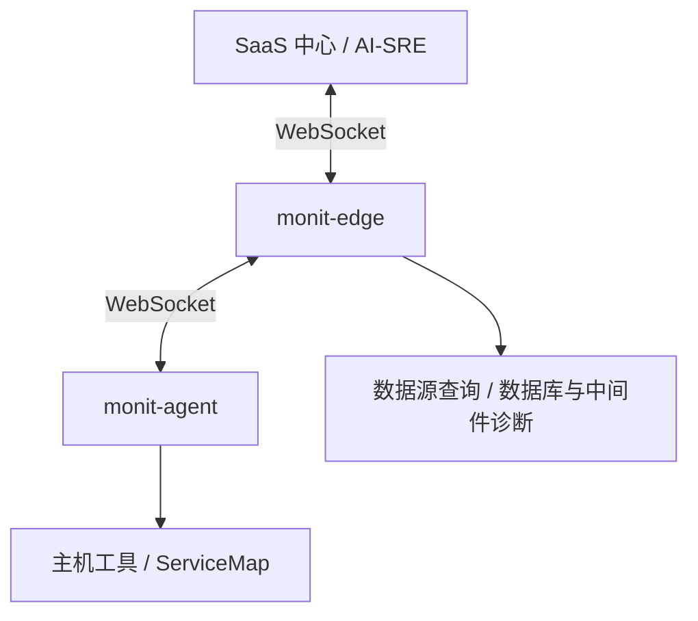

监控对象是 Monitors 可以查询和诊断的目标。安装并启动 `monit-agent` 后，平台会自动展示它上报的主机对象。数据库和中间件通过 Monitors 数据源由 Edge 查询和诊断，不通过 Agent 配置接入。

## 为什么需要 monit-agent

传统可观测性数据通常包括指标、日志、链路追踪和告警事件。这些数据能帮助你判断“发生了什么”，但在实际排障时，经常还需要进一步确认现场状态，例如：

- 当前机器上哪些进程占用 CPU 或内存较高。
- 某个端口、域名或服务是否能从目标机器访问。
- 磁盘、挂载点、网卡、连接数等运行状态是否异常。

这些问题只靠已经采集上来的数据不一定能回答，很多时候需要“连到现场查一下”。`monit-agent` 就是为这个场景设计的。

在 AI-SRE 场景下，可以把 LLM 理解为诊断大脑，把 `monit-agent` 理解为部署在用户环境里的现场执行端。用户用自然语言提出问题后，LLM 负责理解问题、选择合适的诊断工具并解释结果；`monit-agent` 负责在目标主机上执行受控诊断，并把结构化结果返回给系统。

<Warning>
Agent 通过工具策略、参数校验、命令限制、超时和输出限制控制执行，并支持敏感信息脱敏和本地审计。`shell.exec` 的未知命令默认需要本机 root 审批；选择 `allow` 后，这些命令可以直接以 Agent 运行账号执行，可能修改数据或影响服务。配置前请阅读[未知命令策略](/zh/monitors/targets/configure-targets#未知命令策略)。
</Warning>

## 技术架构

`monit-agent` 通过 WebSocket 连接到同网络区域内的 `monitedge`。`monitedge` 再通过 WebSocket 连接到 SaaS 中心。通常每个网络区域部署一套 `monitedge`，同一个 `EngineName` 的多个 `monitedge` 实例会被视为同一套引擎集群。

## 主机诊断与数据源诊断

| 诊断范围 | 接入方式 | 执行位置 |
|---|---|---|
| 主机 CPU、内存、进程、磁盘、网络及容器现场状态 | 在目标主机安装 Agent，按需配置主机工具 | 目标主机上的 `monit-agent` |
| MySQL、Redis、PostgreSQL、MongoDB、Kafka、Elasticsearch 等服务 | 配置对应的 Monitors 数据源 | 能访问数据源的 `monit-edge` |

Agent 提供 `os.overview`、`os.top_processes`、`shell.exec`、`net.tcp_ping` 和 `http.get` 五个主机工具，实际可用集合受 Agent 版本与本地策略控制。TCP/HTTP 探测提供主机视角的连通性证据，数据库内部状态由数据源诊断获取。

Agent 主机工具只作用于主机本身：`tools-catalog` 与 `tools-invoke` 的目标类型仅支持 `host`，数据库服务端点不是 Agent 目标。数据库与中间件的诊断需要改用**数据源工具**（见下文），由能访问数据源的 Edge 执行。数据源工具调用要求数据源 `enabled=true`；`alerting_enabled=false` 不影响诊断。

### 数据源工具

每个已配置的数据源提供一组命名诊断工具，工具名以数据源类型为前缀，例如：

| 数据源类型 | 工具示例 |
|------------|----------|
| MySQL | `mysql.overview`、`mysql.lock_contention` |
| PostgreSQL | `postgres.activity` |
| Redis | `redis_node.slowlog` |
| Kafka | `kafka.consumer_lag` |
| Elasticsearch | `elasticsearch.cat` |
| Prometheus | `prometheus.metric_trends` |
| Loki / VictoriaLogs | `loki.log_patterns`、`victorialogs.log_patterns` |

- **一次调用执行一个命名工具**，通过数据源 ID（`datasource_id`）指定目标。同一个连接地址配置成多个数据源 ID 表示不同的凭据或配置，必须保持独立。
- **没有工具目录**：各类型的工具名称与参数由类型相关参考提供，不要猜测参数。`mysql.query`、`postgres.query` 工具已移除，自由 SQL 查询请使用数据源查询（monit-query 的 Data）能力。
- **版本门禁**：要求所选集群内**所有当前在线可路由的 Edge 会话**支持 v0.71.0 基础 invoke 协议，具体工具可能要求更新的实现。不满足时错误原因见表。
- **没有自动回退**：接口不提供工具目录、自动重放，也不会回退到 Agent 或旧的 diagnose 流程；出现版本类错误时应升级 Edge，而不是重启或轮换 Edge。请求体上限 128 KiB，完整成功响应上限 1 MiB，单次工具执行超时最多 25 秒。

错误通过 `error.reason` 返回：

| reason | 含义 |
|--------|------|
| `edge_upgrade_required` | Edge 版本低于 v0.71.0，需升级集群内的 Edge |
| `mixed_edge_versions` | 集群内 Edge 版本混杂，部分实例过旧，需统一升级 |
| `no_active_edge` | 集群内没有在线可路由的 Edge 会话 |
| `tool_not_supported` | 该工具不被当前实现支持 |
| `invalid_request` | 请求参数错误，需修正参数后重试 |
| `source_too_large` | 请求体超过 128 KiB，需要缩小查询范围 |
| `result_too_large` | 结果超过 1 MiB，需要缩小查询范围 |
| `datasource_disabled` | 数据源未启用（`enabled=false`） |
| `datasource_not_found` | 数据源不存在 |

Agent 同时提供 [ServiceMap](/zh/monitors/targets/servicemap) 的主机拓扑采集与上报能力。

<Tip>
对象标识（`target_locator`）建议使用稳定、容易识别的值，例如固定内网 IP 或 DNS 名称。不要使用 `localhost`、`127.0.0.1` 这类只在本机有意义的地址作为页面展示地址。
</Tip>

## 对象如何出现在页面上

监控对象不需要在页面上手工创建。你只需要在目标机器上安装并启动 `monit-agent`。Agent 成功连接到 Edge 后，会自动上报当前主机身份，页面就会展示该主机。

因此，新用户首次进入监控对象页面时列表为空，通常表示还没有任何 Agent 成功接入。每台 Agent 上报本机主机对象。数据库和中间件的连接在[数据源](/zh/monitors/data-sources/data-sources)中管理。

## 建议接入路径

<Steps>
<Step title="安装并启动 monit-agent">
先接入主机对象，确认 Agent 可以连接 Edge，并能在页面展示当前主机。
</Step>
<Step title="按需配置主机工具">
在 `agent.yaml` 中调整主机采集参数、Shell 执行策略和工具禁用列表。
</Step>
<Step title="验证现场诊断">
确认主机工具可用；如需数据库或中间件诊断，另行配置对应数据源。
</Step>
</Steps>

## 相关文档

<CardGroup cols={2}>
  <Card title="安装 monit-agent" icon="download" href="/zh/monitors/targets/install-agent">
    准备 Edge 地址，下载 Agent，并配置前台启动或系统服务。
  </Card>
  <Card title="配置主机诊断工具" icon="sliders" href="/zh/monitors/targets/configure-targets">
    配置主机采集、Shell 执行策略和工具开关。
  </Card>
</CardGroup>
