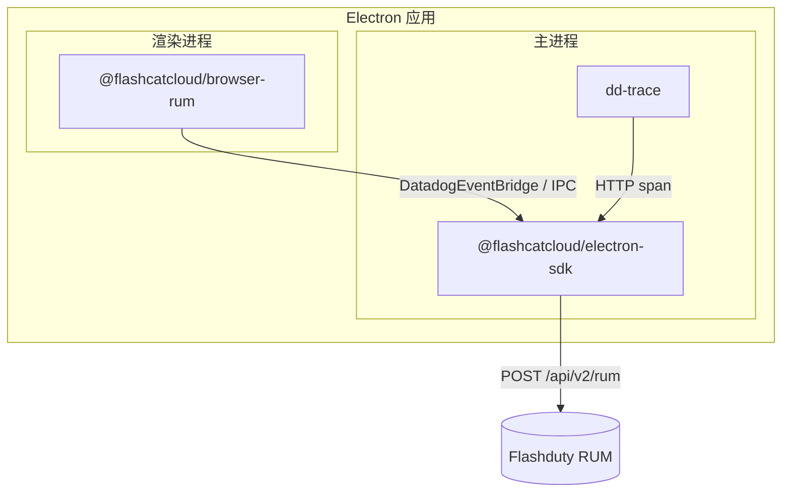

Electron 应用由**主进程**（Node.js）和**渲染进程**（Chromium）组成，两者的运行时完全不同。因此 Electron RUM 接入需要安装两个包：

| 进程 | 安装的包 | 采集内容 |
|------|----------|----------|
| 主进程 | `@flashcatcloud/electron-sdk` | 会话、view、Node 错误、原生崩溃、主进程网络请求 |
| 渲染进程 | `@flashcatcloud/browser-rum` | 页面 view、用户操作、前端资源请求、JS 错误、Web Vitals |

<Warning>
只装一半是最常见的接入错误。只装主进程 SDK 会丢失全部前端交互数据；只装渲染进程 SDK 则拿不到会话、主进程错误和原生崩溃，事件也不会带上关联两个进程的 `container` 信息。请两个进程都完成接入。
</Warning>

## 接入前必读：三个配错了也不报错的坑

下面三件事有一个共同点：**配错了不会有任何报错**。应用照常运行，SDK 不会告警，控制台里也看不出异常，只是某一类数据永远不出现，或者某个功能看起来「没生效」。排查起来很费劲，所以请在动手前先扫一眼。

| 你会看到的现象 | 真正的原因 | 怎么处理 |
|----------------|------------|----------|
| 开了会话回放，但筛不到任何带回放的会话——`session.has_replay` 恒为 `0`，一个分段都没有。表象和「压根没开录制」一模一样 | 页面自带的 CSP 把回放整条链路拦掉了。录制要在渲染进程里创建 blob Worker，还要直接把分段发到上报域名，`script-src 'self'` 这类常见写法会同时挡掉这两件事 | 在 CSP 里放行 `worker-src blob:` 和上报域名，见[会话回放的 CSP 要求](#会话回放的-csp-要求) |
| sourcemap 传了，错误详情里的栈还是 `app:///dist/renderer.js:12315:24` 这样的压缩位置，点开也没有源码 | 上传时的 `--release-version` 和**渲染进程**的 `version` 对不上。渲染进程事件的 `version` 只认 `flashcatRum.init()` 里的配置，主进程 `init()` 配的那个不算数 | 让两处版本号完全一致，见[版本号必须与渲染进程一致](/zh/rum/sdk/electron/advanced-config#版本号必须与渲染进程一致) |
| 回放播到中间突然花屏错位、少了一截，进度条却是连续的 | 那段时间上报地址不可达（请求被拦截、intake 故障、DNS 或代理异常），回放分段被就地丢弃。注意这不是「断网」——真断网时分段会入队重试并在恢复后补发 | 把上报域名加进网络策略的放行名单，见[上报地址不可达时回放分段会丢失](#上报地址不可达时回放分段会丢失) |

第一条和第三条只影响开启了会话回放的应用，第二条对所有应用都适用。

## 工作原理

主进程 SDK 是整个链路的**统一出口**。它做三件事：

1. 通过 `dd-trace` 挂钩 `require('electron')`，包装 `BrowserWindow` 并向每个渲染进程注入 preload 脚本，暴露全局对象 `DatadogEventBridge`
2. 渲染进程的 `@flashcatcloud/browser-rum` 检测到该桥接对象后，把采集到的事件通过 IPC 发回主进程，而不是自己直连上报
3. 主进程给两侧事件统一补充上下文——自己的事件补全套公共属性，渲染进程事件只覆盖 `session.id` / `application.id` 并补 `container`——然后落盘成批，上报到 `POST https://<site>/api/v2/rum`



<Note>
包内部的模块名、插件名和桥接对象名保留了 `Datadog` / `dd-` 前缀（例如 `DatadogEventBridge`、`datadogVitePlugin`）。这是 fork 上游命名的约定，不影响数据归属——事件只会上报到你配置的 Flashduty `site`。
</Note>

## 前提条件

- Electron 39 及以上（SDK 的 `peerDependencies` 要求）
- 在 Flashduty 控制台的 [RUM 应用管理](https://console.flashcat.cloud/rum/apps)页面创建或选择一个 **Electron** 类型应用，获取 **Application ID** 和 **Client Token**
- 确认应用运行环境可以访问 `https://browser.flashcat.cloud/api/v2/rum`（私有化部署则为你自己的上报地址）

## 安装

```bash
# 主进程
npm install @flashcatcloud/electron-sdk

# 渲染进程
npm install @flashcatcloud/browser-rum
```

## 主进程接入

### 引入 instrument 入口

`@flashcatcloud/electron-sdk/instrument` 必须在**任何 `electron` 导入之前**执行。它负责初始化 `dd-trace`，而 `dd-trace` 需要在 `require('electron')` 发生前完成模块挂钩，否则 `BrowserWindow` 的 preload 注入不会生效，渲染进程也就拿不到桥接对象。

```ts main.ts
// 必须是文件的第一行导入
import '@flashcatcloud/electron-sdk/instrument';

import { app, BrowserWindow } from 'electron';
```

<Warning>
不要让格式化工具或 `import` 排序规则把这一行移到后面。如果你的项目使用 ESLint 的 `import/order` 或 `simple-import-sort`，请为该行添加忽略注释。
</Warning>

### 初始化 SDK

在创建任何 `BrowserWindow` 之前调用 `init()`。它是异步的，返回 `true` 表示配置合法、初始化成功。

```ts main.ts
import '@flashcatcloud/electron-sdk/instrument';

import { app, BrowserWindow } from 'electron';
import { init } from '@flashcatcloud/electron-sdk';

void app.whenReady().then(async () => {
  await init({
    applicationId: '<YOUR_APPLICATION_ID>',
    clientToken: '<YOUR_CLIENT_TOKEN>',
    service: 'my-electron-app',
    site: 'browser.flashcat.cloud',
    env: 'production',
    version: app.getVersion(),
  });

  createWindow();
});
```

#### 必填参数

<ParamField body="applicationId" type="string" required>
应用 ID，在应用管理页面获取
</ParamField>

<ParamField body="clientToken" type="string" required>
客户端 Token，在应用管理页面获取
</ParamField>

<ParamField body="service" type="string" required>
服务名称，用于区分不同的服务。上传 sourcemap 时需要使用相同的值
</ParamField>

<Warning>
`clientToken` 只用于客户端 RUM 上报，请不要在客户端代码中写入服务端密钥。
</Warning>

#### 上报站点

<ParamField body="site" type="string" default="browser.flashcat.cloud">
上报站点，直接作为 intake 域名使用。SaaS 用户无需配置；私有化部署填你自己的域名
</ParamField>

<Note>
SDK 拼接的上报地址固定为 `https://<site>/api/v2/rum`——**协议头 `https://` 是写死的**。如果你的内网 intake 只有纯 HTTP，`site` 填什么都没用，必须改用 `proxy`，见[什么时候必须用 proxy](/zh/rum/sdk/electron/advanced-config#什么时候必须用-proxy)。
</Note>

完整可选参数见[高级配置](/zh/rum/sdk/electron/advanced-config)。

## 打包工具插件

`dd-trace` 依赖运行时的模块加载顺序。而打包工具（Vite、Webpack、esbuild）会重排、内联或提升 `require()`，让 `import '@flashcatcloud/electron-sdk/instrument'` 失去「最先执行」的位置。SDK 因此提供了三个打包插件，它们会：

- 把 `dd-trace` 与 `@flashcatcloud/electron-sdk` 标记为 external，保留为运行时 `require`
- 在主进程入口 chunk 的最顶部注入 instrument 初始化代码（**因此使用插件后无需再手写那行 import**）
- 把 `dd-trace` 的 preload 脚本和被 external 的依赖复制进构建产物的 `node_modules`，保证打包后的应用（如 Electron Forge 的 asar）在运行时能解析到它们

请按你的构建方式**任选其一**。

<Tabs>
<Tab title="Vite">
适用于 electron-vite、Electron Forge + Vite。

```ts vite.config.ts
import { defineConfig } from 'vite';
import { datadogVitePlugin } from '@flashcatcloud/electron-sdk/vite-plugin';

export default defineConfig({
  plugins: [datadogVitePlugin()],
});
```

<Note>
请把插件加到**主进程**的构建配置上。electron-vite 的配置中对应 `main` 段，而不是 `renderer` 段。
</Note>
</Tab>

<Tab title="Webpack">
适用于 Electron Forge + Webpack。

```js webpack.main.config.js
const { DatadogWebpackPlugin } = require('@flashcatcloud/electron-sdk/webpack-plugin');

module.exports = {
  plugins: [new DatadogWebpackPlugin()],
};
```

插件同时会把 `dd-trace` 和 SDK 从 `@vercel/webpack-asset-relocator-loader` 中排除——该 loader 会破坏 `dd-trace` 内部的动态 `require.resolve`。
</Tab>

<Tab title="esbuild">
```ts build.ts
import * as esbuild from 'esbuild';
import { datadogEsbuildPlugin } from '@flashcatcloud/electron-sdk/esbuild-plugin';

await esbuild.build({
  entryPoints: ['src/main.ts'],
  bundle: true,
  platform: 'node',
  outfile: 'dist/main.js',
  plugins: [datadogEsbuildPlugin()],
});
```
</Tab>
</Tabs>

<Tip>
输出 ESM 格式时，静态 `import` 会先于模块代码求值，`dd-trace` 的钩子无法拦截 `import 'electron'`。三个插件都对 ESM 做了处理：改为直接调用 `session.defaultSession.registerPreloadScript()` 注册 preload，效果等价。你不需要额外配置。
</Tip>

## 渲染进程接入

渲染进程加载的页面按 [Web SDK](/zh/rum/sdk/web/sdk-integration) 的 NPM 方式接入即可，无需改动初始化写法。

```ts renderer.ts
import { flashcatRum } from '@flashcatcloud/browser-rum';

flashcatRum.init({
  applicationId: '<YOUR_APPLICATION_ID>',
  clientToken: '<YOUR_CLIENT_TOKEN>',
  service: 'my-electron-app',
  site: 'browser.flashcat.cloud',
  env: 'production',
  version: '1.0.0',
  sessionSampleRate: 100,
  trackResources: true,
  trackLongTasks: true,
  trackUserInteractions: true,
});
```

<Tip>
`applicationId`、`clientToken`、`service`、`env`、`version` 建议与主进程 `init()` 保持一致，否则两侧数据会被归到不同的应用或版本，无法在同一个会话里串起来。
</Tip>

### 桥接无需配置

渲染进程侧**不需要任何额外接线**。主进程注入的 preload 在组装 host 白名单时，总是把窗口自身的 `location.hostname` 并进去：

```js
const allowedHosts = [...new Set([location.hostname, ...configuredHosts])]
```

因此窗口自身的页面**永远命中白名单**，桥接开箱即用。`file://` 也不例外——此时 `location.hostname` 是空字符串，白名单为 `[""]`，仍然自匹配。

<Note>
`allowedWebViewHosts` 不是桥接开关，而是**额外 host 的白名单**。只有当你想接收 `<webview>` 或 `BrowserView` 里加载的**第三方页面**的事件时才需要配置它，例如 `allowedWebViewHosts: ['partner.example.com']`。匹配规则支持子域名后缀。
</Note>

### 桥接未生效时会怎样

桥接失效的原因不是配置，而是 **preload 没有被注入**——通常是主进程未接入 SDK，或主进程被打包但没挂对应的[打包工具插件](#打包工具插件)，导致 `instrument` 入口失去了最先执行的位置。

| 行为 | 桥接生效 | 桥接未生效 |
|------|----------|------------|
| 渲染进程事件的 `container.source` | `electron` | 字段缺失 |
| 上报出口 | 主进程统一批量上报 | 渲染进程各自直连 intake |
| 会话 | 与主进程共享同一个 `session.id` | 渲染进程独立生成会话 |
| 离线补报 | 事件落盘到主进程 `userData`，重启后续传 | 依赖浏览器端的内存重试队列：只覆盖真断网，进程退出即丢失 |
| 用户活跃度 | 渲染进程的点击会续期主进程会话 | 互不影响 |

<Tip>
`container.source` 是判断桥接是否生效的可靠信号：渲染进程事件带上它，说明 preload 注入成功、事件确实经主进程上报。
</Tip>

### 两个进程的 source 取值

桥接生效时，主进程只覆盖渲染进程事件的 `session.id` 和 `application.id`，并补上 `container`；渲染进程事件**保留自己的 `source: browser`**。两类事件的标识因此不同：

| 事件来源 | `source` | `container.source` | `view.url` |
|----------|----------|--------------------|------------|
| 主进程 | `electron` | 无 | `electron://main-process` |
| 渲染进程窗口 | `browser` | `electron` | 页面 URL |

<Warning>
在查看器里筛选时，只用 `source:electron` **只能查到主进程事件**。要选中一个 Electron 应用产生的全部数据，请用 `source:electron OR container.source:electron`。
</Warning>

## 会话回放

Electron 的会话回放由渲染进程的 `@flashcatcloud/browser-rum` 录制。默认情况下，渲染进程一旦检测到主进程注入的桥接对象，就会把回放交给宿主应用处理——而主进程 SDK 并不录制回放，结果是**什么都录不到**。要在 Electron 里用回放，必须显式打开 `sessionReplayDirectUpload`，让渲染进程自己录、自己传：

```ts renderer.ts
flashcatRum.init({
  // …其余配置同上
  sessionReplaySampleRate: 100,
  sessionReplayDirectUpload: true,
  defaultPrivacyLevel: 'mask',
});
```

<Note>
`sessionReplaySampleRate` 默认是 `0`，只打开 `sessionReplayDirectUpload` 什么也录不到，两个都要配。
</Note>

打开之后，回放数据的链路和其他数据**不一样**：普通 RUM 事件仍然经桥接交给主进程落盘、批量上报，而回放分段由渲染进程**直接发往上报域名**，完全不经过主进程。下面两节的两个坑都来自这个差异。

### 会话回放的 CSP 要求

录制回放时，渲染进程要做两件事，而它们恰好都是 CSP 默认会拦住的：

1. 用 `blob:` URL 创建一个 Worker——分段在这个 Worker 里压缩
2. 直接向上报域名发请求——把压缩好的分段送到 `POST https://<site>/api/v2/rum`

Electron 应用出于安全考虑通常都给页面配了 CSP，例如 `<meta http-equiv="Content-Security-Policy" content="default-src 'self'; script-src 'self'">`。这样一条常见的 CSP 会把上面两件事同时挡掉，**回放整条链路就此静默失效**。

**症状**：控制台里筛不到任何带回放的会话，`session.has_replay` 恒为 `0`，一个分段都没有。这和「压根没开录制」的表现完全一样，光看数据分辨不出来。

**为什么没有报错**：唯一的线索是渲染进程 DevTools console 里的两行报错，数据层面完全无声——不会产生错误事件，控制台里也不会有任何提示：

```
Creating a worker from 'blob:file:///…' violates the following Content Security Policy directive: "script-src 'self'". Note that 'worker-src' was not explicitly set, so 'script-src' is used as a fallback. The action has been blocked.
Datadog Browser SDK: Datadog Session Replay failed to start: an error occurred while initializing the worker
```

<Note>
这和页面用什么协议加载没有关系。把页面换成 `http://` 托管，Worker 一样被拦——拦截来自页面自己的 CSP，既不是 `file://` 协议的问题，也不是 Electron 或 SDK 的问题。
</Note>

**怎么配**：CSP 里要放行 `worker-src blob:`，并把上报域名加进 `connect-src`。注意 `worker-src` 没有显式声明时会回退到 `script-src`，所以只写 `script-src 'self'` 是不够的，必须单独写出 `worker-src`：

```html
<meta http-equiv="Content-Security-Policy" content="
  default-src 'self';
  script-src 'self';
  worker-src 'self' blob:;
  connect-src 'self' https://browser.flashcat.cloud;
">
```

`connect-src` 里填你实际的上报地址：SaaS 用户是 `https://browser.flashcat.cloud`，私有化部署填自己的 `site`，配了 `proxy` 的填 `proxy` 的域名。如果你的 CSP 不是写在 `<meta>` 里，而是由服务端响应头或主进程的 `session.webRequest.onHeadersReceived` 下发，也要做同样的放行。

**怎么确认放开了**：在渲染进程里调用 `flashcatRum.getSessionReplayLink()`。返回的链接里带 `error-type=replay-not-started` 说明录制没起来；正常起来时返回的是一个可以直接打开的回放地址。

### 上报地址不可达时回放分段会丢失

回放分段由渲染进程直传，走的是浏览器 SDK 自己的传输层，**不经过主进程的落盘重试**。这条链路本身是有缓存和重试的，但它只覆盖一类失败，另一类会直接丢弃。

判定是否重试的条件是：HTTP 408、429、5xx，或者「请求根本没发出去（`status` 为 `0`）**且** `navigator.onLine === false`」。落到实际场景上就是两种结果：

| 场景 | `navigator.onLine` | 行为 |
|------|--------------------|------|
| 真断网：网卡下线、关掉 Wi-Fi、拔网线、切飞行模式 | `false` | 分段进入重试队列，网络恢复后按序补发 |
| 上报地址不可达：请求被安全软件或网关拦截、intake 故障、DNS 解析失败、防火墙或代理异常 | `true` | 立即丢弃，不入队、不重试 |

**真断网会补发**：失败的分段进入内存重试队列（上限 3 MiB），按指数退避重发，间隔从 1 秒逐次翻倍到最多 1 分钟，某次成功后再把排队的分段依次发出。所以关掉 Wi-Fi 走一段路再连回来，回放通常是完整的。

**机器在线但上报地址不可达才会丢**：这时浏览器认为自己是联网的，`navigator.onLine` 仍然是 `true`，请求失败后既不重试也不入队，分段就地丢弃，也不会产生任何错误事件。VPN 掉线、公司网关或终端安全软件拦截上报域名、intake 临时不可用、代理配置错误，都属于这一类。

**症状**：回放能播，但中间**少掉一段**——分段序号 `index_in_view` 出现跳号，例如从 1 直接跳到 4，中间的 2、3 号不会补回来。更麻烦的是恢复后的第一个分段**不带全量快照**（`has_full_snapshot` 为 `0`），播放器只能在中断前那个过时的页面状态上继续叠加增量，于是那一段回放会花屏错位，而不只是「少了几秒」。

**还有一种情况会丢**：重试队列在内存里，不落盘。分段还在排队等待重发时应用退出或被强杀，这些分段不会在下次启动时续传。

**对比主进程**：主进程的事件走的是落盘批量上传——事件先写进 `userData` 下的批次文件，上传成功才删除。所以上面两类失败都不影响主进程的 view、error、resource：网络或 intake 恢复后会完整补发，应用被强杀再启动也会续传。这个差异只影响回放分段。

<Note>
这是渲染进程直传链路的行为边界，不是缺陷，也不能通过 SDK 配置改变。如果你的业务对回放完整性敏感（例如要靠回放做纠纷取证），把上报域名加进网络策略、代理和终端安全软件的放行名单，可以消除其中最常见的那一类丢失。
</Note>

## 验证接入

<Steps>
<Step title="启动应用并观察控制台">
主进程日志中会输出 SDK 的初始化信息。`init()` 返回 `false` 时会打印具体的配置错误（如缺少必填项）。
</Step>

<Step title="触发各类事件">
- 主进程：发起一次 HTTP 请求、抛一个未捕获异常
- 渲染进程：点击页面元素、切换路由、发起一次 `fetch`
</Step>

<Step title="在控制台确认数据">
打开对应的 RUM 应用，在[查看器](/zh/rum/explorer/overview)中按 `source:electron OR container.source:electron` 过滤，确认出现 `view`、`action`、`resource`、`error` 事件。

默认上报频率为 10 秒一批，请稍等片刻再刷新。
</Step>

<Step title="确认双进程已关联">
在同一条会话下同时看到主进程事件（`view.url` 为 `electron://main-process`）和渲染进程事件（`action`、Web Vitals），说明桥接已生效。

若渲染进程事件**没有 `container.source` 字段**，说明 preload 未被注入：请检查主进程是否已调用 `init()`，以及主进程被打包时是否挂了[打包工具插件](#打包工具插件)。
</Step>
</Steps>

## 下一步

<CardGroup cols={3}>
<Card title="高级配置" icon="sliders" href="/zh/rum/sdk/electron/advanced-config">
配置上报批次、代理、手动错误上报与 sourcemap 上传。
</Card>

<Card title="兼容性" icon="shield-check" href="/zh/rum/sdk/electron/compatible">
了解支持的 Electron 版本、操作系统、打包工具与当前限制。
</Card>

<Card title="数据收集" icon="database" href="/zh/rum/sdk/electron/data-collection">
查看两个进程分别采集的事件类型、字段与上报行为。
</Card>
</CardGroup>
