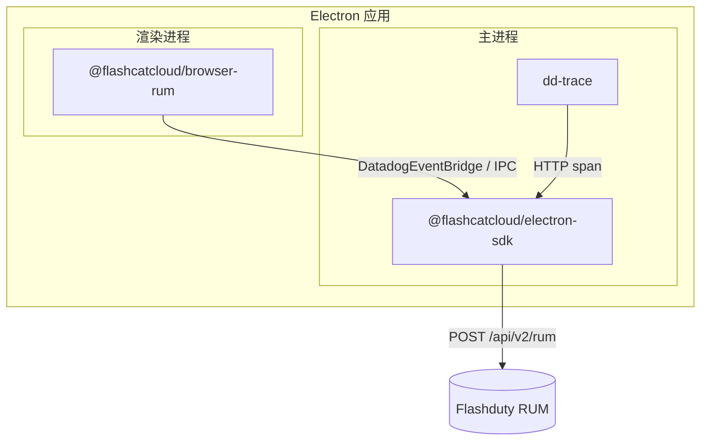

Electron 应用由**主进程**（Node.js）和**渲染进程**（Chromium）组成，两者的运行时完全不同。因此 Electron RUM 接入需要安装两个包：

| 进程 | 安装的包 | 采集内容 |
|------|----------|----------|
| 主进程 | `@flashcatcloud/electron-sdk` | 会话、view、Node 错误、原生崩溃、主进程网络请求 |
| 渲染进程 | `@flashcatcloud/browser-rum` | 页面 view、用户操作、前端资源请求、JS 错误、Web Vitals |

<Warning>
只装一半是最常见的接入错误。只装主进程 SDK 会丢失全部前端交互数据；只装渲染进程 SDK 则拿不到会话、主进程错误和原生崩溃，事件也不会带上关联两个进程的 `container` 信息。请两个进程都完成接入。
</Warning>

## 工作原理

主进程 SDK 是整个链路的**统一出口**。它做三件事：

1. 通过 `dd-trace` 挂钩 `require('electron')`，包装 `BrowserWindow` 并向每个渲染进程注入 preload 脚本，暴露全局对象 `DatadogEventBridge`
2. 渲染进程的 `@flashcatcloud/browser-rum` 检测到该桥接对象后，把采集到的事件通过 IPC 发回主进程，而不是自己直连上报
3. 主进程给两侧事件统一补充上下文——自己的事件补全套公共属性，渲染进程事件只覆盖 `session.id` / `application.id` 并补 `container`——然后落盘成批，上报到 `POST https://<site>/api/v2/rum`



<Note>
包内部的模块名、插件名和桥接对象名保留了 `Datadog` / `dd-` 前缀（例如 `DatadogEventBridge`、`datadogVitePlugin`）。这是 fork 上游命名的约定，不影响数据归属——事件只会上报到你配置的 Flashduty `site`。
</Note>

## 前提条件

- Electron 39 及以上（SDK 的 `peerDependencies` 要求）
- 在 Flashduty 控制台的 [RUM 应用管理](https://console.flashcat.cloud/rum/apps)页面创建或选择一个 **Electron** 类型应用，获取 **Application ID** 和 **Client Token**
- 确认应用运行环境可以访问 `https://browser.flashcat.cloud/api/v2/rum`（私有化部署则为你自己的上报地址）

## 安装

```bash
# 主进程
npm install @flashcatcloud/electron-sdk

# 渲染进程
npm install @flashcatcloud/browser-rum
```

## 主进程接入

### 引入 instrument 入口

`@flashcatcloud/electron-sdk/instrument` 必须在**任何 `electron` 导入之前**执行。它负责初始化 `dd-trace`，而 `dd-trace` 需要在 `require('electron')` 发生前完成模块挂钩，否则 `BrowserWindow` 的 preload 注入不会生效，渲染进程也就拿不到桥接对象。

```ts main.ts
// 必须是文件的第一行导入
import '@flashcatcloud/electron-sdk/instrument';

import { app, BrowserWindow } from 'electron';
```

<Warning>
不要让格式化工具或 `import` 排序规则把这一行移到后面。如果你的项目使用 ESLint 的 `import/order` 或 `simple-import-sort`，请为该行添加忽略注释。
</Warning>

### 初始化 SDK

在创建任何 `BrowserWindow` 之前调用 `init()`。它是异步的，返回 `true` 表示配置合法、初始化成功。

```ts main.ts
import '@flashcatcloud/electron-sdk/instrument';

import { app, BrowserWindow } from 'electron';
import { init } from '@flashcatcloud/electron-sdk';

void app.whenReady().then(async () => {
  await init({
    applicationId: '<YOUR_APPLICATION_ID>',
    clientToken: '<YOUR_CLIENT_TOKEN>',
    service: 'my-electron-app',
    site: 'browser.flashcat.cloud',
    env: 'production',
    version: app.getVersion(),
  });

  createWindow();
});
```

#### 必填参数

<ParamField body="applicationId" type="string" required>
应用 ID，在应用管理页面获取
</ParamField>

<ParamField body="clientToken" type="string" required>
客户端 Token，在应用管理页面获取
</ParamField>

<ParamField body="service" type="string" required>
服务名称，用于区分不同的服务。上传 sourcemap 时需要使用相同的值
</ParamField>

<Warning>
`clientToken` 只用于客户端 RUM 上报，请不要在客户端代码中写入服务端密钥。
</Warning>

#### 上报站点

<ParamField body="site" type="string" default="browser.flashcat.cloud">
上报站点，直接作为 intake 域名使用。SaaS 用户无需配置；私有化部署填你自己的域名
</ParamField>

<Note>
SDK 拼接的上报地址固定为 `https://<site>/api/v2/rum`——**协议头 `https://` 是写死的**。如果你的内网 intake 只有纯 HTTP，`site` 填什么都没用，必须改用 `proxy`，见[什么时候必须用 proxy](/zh/rum/sdk/electron/advanced-config#什么时候必须用-proxy)。
</Note>

完整可选参数见[高级配置](/zh/rum/sdk/electron/advanced-config)。

## 打包工具插件

`dd-trace` 依赖运行时的模块加载顺序。而打包工具（Vite、Webpack、esbuild）会重排、内联或提升 `require()`，让 `import '@flashcatcloud/electron-sdk/instrument'` 失去「最先执行」的位置。SDK 因此提供了三个打包插件，它们会：

- 把 `dd-trace` 与 `@flashcatcloud/electron-sdk` 标记为 external，保留为运行时 `require`
- 在主进程入口 chunk 的最顶部注入 instrument 初始化代码（**因此使用插件后无需再手写那行 import**）
- 把 `dd-trace` 的 preload 脚本和被 external 的依赖复制进构建产物的 `node_modules`，保证打包后的应用（如 Electron Forge 的 asar）在运行时能解析到它们

请按你的构建方式**任选其一**。

<Tabs>
<Tab title="Vite">
适用于 electron-vite、Electron Forge + Vite。

```ts vite.config.ts
import { defineConfig } from 'vite';
import { datadogVitePlugin } from '@flashcatcloud/electron-sdk/vite-plugin';

export default defineConfig({
  plugins: [datadogVitePlugin()],
});
```

<Note>
请把插件加到**主进程**的构建配置上。electron-vite 的配置中对应 `main` 段，而不是 `renderer` 段。
</Note>
</Tab>

<Tab title="Webpack">
适用于 Electron Forge + Webpack。

```js webpack.main.config.js
const { DatadogWebpackPlugin } = require('@flashcatcloud/electron-sdk/webpack-plugin');

module.exports = {
  plugins: [new DatadogWebpackPlugin()],
};
```

插件同时会把 `dd-trace` 和 SDK 从 `@vercel/webpack-asset-relocator-loader` 中排除——该 loader 会破坏 `dd-trace` 内部的动态 `require.resolve`。
</Tab>

<Tab title="esbuild">
```ts build.ts
import * as esbuild from 'esbuild';
import { datadogEsbuildPlugin } from '@flashcatcloud/electron-sdk/esbuild-plugin';

await esbuild.build({
  entryPoints: ['src/main.ts'],
  bundle: true,
  platform: 'node',
  outfile: 'dist/main.js',
  plugins: [datadogEsbuildPlugin()],
});
```
</Tab>
</Tabs>

<Tip>
输出 ESM 格式时，静态 `import` 会先于模块代码求值，`dd-trace` 的钩子无法拦截 `import 'electron'`。三个插件都对 ESM 做了处理：改为直接调用 `session.defaultSession.registerPreloadScript()` 注册 preload，效果等价。你不需要额外配置。
</Tip>

## 渲染进程接入

渲染进程加载的页面按 [Web SDK](/zh/rum/sdk/web/sdk-integration) 的 NPM 方式接入即可，无需改动初始化写法。

```ts renderer.ts
import { flashcatRum } from '@flashcatcloud/browser-rum';

flashcatRum.init({
  applicationId: '<YOUR_APPLICATION_ID>',
  clientToken: '<YOUR_CLIENT_TOKEN>',
  service: 'my-electron-app',
  site: 'browser.flashcat.cloud',
  env: 'production',
  version: '1.0.0',
  sessionSampleRate: 100,
  trackResources: true,
  trackLongTasks: true,
  trackUserInteractions: true,
});
```

<Tip>
`applicationId`、`clientToken`、`service`、`env`、`version` 建议与主进程 `init()` 保持一致，否则两侧数据会被归到不同的应用或版本，无法在同一个会话里串起来。
</Tip>

### 桥接无需配置

渲染进程侧**不需要任何额外接线**。主进程注入的 preload 在组装 host 白名单时，总是把窗口自身的 `location.hostname` 并进去：

```js
const allowedHosts = [...new Set([location.hostname, ...configuredHosts])]
```

因此窗口自身的页面**永远命中白名单**，桥接开箱即用。`file://` 也不例外——此时 `location.hostname` 是空字符串，白名单为 `[""]`，仍然自匹配。

<Note>
`allowedWebViewHosts` 不是桥接开关，而是**额外 host 的白名单**。只有当你想接收 `<webview>` 或 `BrowserView` 里加载的**第三方页面**的事件时才需要配置它，例如 `allowedWebViewHosts: ['partner.example.com']`。匹配规则支持子域名后缀。
</Note>

### 桥接未生效时会怎样

桥接失效的原因不是配置，而是 **preload 没有被注入**——通常是主进程未接入 SDK，或主进程被打包但没挂对应的[打包工具插件](#打包工具插件)，导致 `instrument` 入口失去了最先执行的位置。

| 行为 | 桥接生效 | 桥接未生效 |
|------|----------|------------|
| 渲染进程事件的 `container.source` | `electron` | 字段缺失 |
| 上报出口 | 主进程统一批量上报 | 渲染进程各自直连 intake |
| 会话 | 与主进程共享同一个 `session.id` | 渲染进程独立生成会话 |
| 离线补报 | 事件落盘到主进程 `userData`，重启后续传 | 依赖浏览器端缓冲，进程退出即丢失 |
| 用户活跃度 | 渲染进程的点击会续期主进程会话 | 互不影响 |

<Tip>
`container.source` 是判断桥接是否生效的可靠信号：渲染进程事件带上它，说明 preload 注入成功、事件确实经主进程上报。
</Tip>

### 两个进程的 source 取值

桥接生效时，主进程只覆盖渲染进程事件的 `session.id` 和 `application.id`，并补上 `container`；渲染进程事件**保留自己的 `source: browser`**。两类事件的标识因此不同：

| 事件来源 | `source` | `container.source` | `view.url` |
|----------|----------|--------------------|------------|
| 主进程 | `electron` | 无 | `electron://main-process` |
| 渲染进程窗口 | `browser` | `electron` | 页面 URL |

<Warning>
在查看器里筛选时，只用 `source:electron` **只能查到主进程事件**。要选中一个 Electron 应用产生的全部数据，请用 `source:electron OR container.source:electron`。
</Warning>

## 验证接入

<Steps>
<Step title="启动应用并观察控制台">
主进程日志中会输出 SDK 的初始化信息。`init()` 返回 `false` 时会打印具体的配置错误（如缺少必填项）。
</Step>

<Step title="触发各类事件">
- 主进程：发起一次 HTTP 请求、抛一个未捕获异常
- 渲染进程：点击页面元素、切换路由、发起一次 `fetch`
</Step>

<Step title="在控制台确认数据">
打开对应的 RUM 应用，在[查看器](/zh/rum/explorer/overview)中按 `source:electron OR container.source:electron` 过滤，确认出现 `view`、`action`、`resource`、`error` 事件。

默认上报频率为 10 秒一批，请稍等片刻再刷新。
</Step>

<Step title="确认双进程已关联">
在同一条会话下同时看到主进程事件（`view.url` 为 `electron://main-process`）和渲染进程事件（`action`、Web Vitals），说明桥接已生效。

若渲染进程事件**没有 `container.source` 字段**，说明 preload 未被注入：请检查主进程是否已调用 `init()`，以及主进程被打包时是否挂了[打包工具插件](#打包工具插件)。
</Step>
</Steps>

## 下一步

<CardGroup cols={3}>
<Card title="高级配置" icon="sliders" href="/zh/rum/sdk/electron/advanced-config">
配置上报批次、代理、手动错误上报与 sourcemap 上传。
</Card>

<Card title="兼容性" icon="shield-check" href="/zh/rum/sdk/electron/compatible">
了解支持的 Electron 版本、操作系统、打包工具与当前限制。
</Card>

<Card title="数据收集" icon="database" href="/zh/rum/sdk/electron/data-collection">
查看两个进程分别采集的事件类型、字段与上报行为。
</Card>
</CardGroup>
